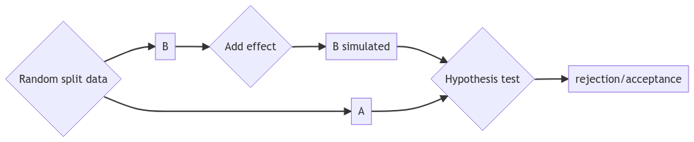

# cluster_experiments

[](https://pepy.tech/project/cluster-experiments)
[](
https://pypi.org/project/cluster-experiments/)
[](https://github.com/david26694/cluster-experiments/actions)
[](https://app.codecov.io/gh/david26694/cluster-experiments/)

[](https://pypi.python.org/pypi/cluster-experiments)

A library to run simulation-based power analysis, including clustered data. Also useful to design and analyse clustered and switchback experiments.




## Examples

### Hello world

Hello world of the library, non-clustered version. There is an outcome variable analyzed with a linear regression. The perturbator adds a constant effect to treated units, and the splitter is random.

```python title="Non-clustered"
import numpy as np
import pandas as pd
from cluster_experiments import PowerAnalysis

# Create fake data
N = 1_000
df = pd.DataFrame(
    {
        "target": np.random.normal(0, 1, size=N),
    }
)

config = {
    "analysis": "ols_non_clustered",
    "perturbator": "constant",
    "splitter": "non_clustered",
    "n_simulations": 50,
}
pw = PowerAnalysis.from_dict(config)

# Keep in mind that the average effect is the absolute effect added, this is not relative!
power = pw.power_analysis(df, average_effect=0.1)

# You may also get the power curve by running the power analysis with different average effects
power_line = pw.power_line(df, average_effects=[0, 0.1, 0.2])

```

### Switchback

Hello world of this library, clustered version. Since it uses dates as clusters, we consider it a switchback experiment. However, if you want to run a clustered experiment, you can use the same code without the dates.

```python title="Switchback - config-based"

from datetime import date

import numpy as np
import pandas as pd
from cluster_experiments.power_analysis import PowerAnalysis

# Create fake data
N = 1_000
clusters = [f"Cluster {i}" for i in range(100)]
dates = [f"{date(2022, 1, i):%Y-%m-%d}" for i in range(1, 32)]
df = pd.DataFrame(
    {
        "cluster": np.random.choice(clusters, size=N),
        "target": np.random.normal(0, 1, size=N),
        "date": np.random.choice(dates, size=N),
    }
)

config = {
    "cluster_cols": ["cluster", "date"],
    "analysis": "gee",
    "perturbator": "constant",
    "splitter": "clustered",
    "n_simulations": 50,
}
pw = PowerAnalysis.from_dict(config)

print(df)
# Keep in mind that the average effect is the absolute effect added, this is not relative!
power = pw.power_analysis(df, average_effect=0.1)
print(f"{power = }")
```

### Long example

This is a comprehensive example of how to use this library. There are simpler ways to run this power analysis above but this shows all the building blocks of the library.

```python title="Switchback - using classes"
from datetime import date

import numpy as np
import pandas as pd
from cluster_experiments.experiment_analysis import GeeExperimentAnalysis
from cluster_experiments.perturbator import ConstantPerturbator
from cluster_experiments.power_analysis import PowerAnalysis
from cluster_experiments.random_splitter import ClusteredSplitter

# Create fake data
N = 1_000
clusters = [f"Cluster {i}" for i in range(100)]
dates = [f"{date(2022, 1, i):%Y-%m-%d}" for i in range(1, 32)]
df = pd.DataFrame(
    {
        "cluster": np.random.choice(clusters, size=N),
        "target": np.random.normal(0, 1, size=N),
        "date": np.random.choice(dates, size=N),
    }
)

# A switchback experiment is going to be run, prepare the switchback splitter for the analysis
sw = ClusteredSplitter(
    cluster_cols=["cluster", "date"],
)

# We use a constant perturbator to add artificial effect on the treated on the power analysis
perturbator = ConstantPerturbator()

# Use gee to run the analysis
analysis = GeeExperimentAnalysis(
    cluster_cols=["cluster", "date"],
)

# Run the power analysis
pw = PowerAnalysis(
    perturbator=perturbator, splitter=sw, analysis=analysis, n_simulations=50, seed=123
)

# Keep in mind that the average effect is the absolute effect added, this is not relative!
power = pw.power_analysis(df, average_effect=0.1)
print(f"{power = }")
```

## Features

The library offers the following classes:

* Regarding power analysis:
    * `PowerAnalysis`: to run power analysis on a clustered/switchback design
    * `ConstantPerturbator`: to artificially perturb treated group with constant perturbations
    * `BinaryPerturbator`: to artificially perturb treated group for binary outcomes
    * `RelativePositivePerturbator`: to artificially perturb treated group with relative positive perturbations
    * `NormalPerturbator`: to artificially perturb treated group with normal distribution perturbations
    * `BetaRelativePositivePerturbator`: to artificially perturb treated group with relative positive beta distribution perturbations
    * `BetaRelativePerturbator`: to artificially perturb treated group with relative beta distribution perturbations in a specified support interval
    * `SegmentedBetaRelativePerturbator`: to artificially perturb treated group with relative beta distribution perturbations in a specified support interval, but using clusters
* Regarding splitting data:
    * `ClusteredSplitter`: to split data based on clusters
    * `BalancedClusteredSplitter`: to split data based on clusters in a balanced way
    * `NonClusteredSplitter`: Regular data splitting, no clusters
    * `StratifiedClusteredSplitter`: to split based on clusters and strata, balancing the number of clusters in each stratus
    * `RepeatedSampler`: for backtests where we have access to counterfactuals, does not split the data, just duplicates the data for all groups
    * Switchback splitters (the same can be done with clustered splitters, but there is a convenient way to define switchback splitters using switch frequency):
        * `SwitchbackSplitter`: to split data based on clusters and dates, for switchback experiments
        * `BalancedSwitchbackSplitter`: to split data based on clusters and dates, for switchback experiments, balancing treatment and control among all clusters
        * `StratifiedSwitchbackSplitter`: to split data based on clusters and dates, for switchback experiments, balancing the number of clusters in each stratus
        * Washover for switchback experiments:
            * `EmptyWashover`: no washover done at all.
            * `ConstantWashover`: accepts a timedelta parameter and removes the data when we switch from A to B for the timedelta interval.
* Regarding analysis:
    * `GeeExperimentAnalysis`: to run GEE analysis on the results of a clustered design
    * `MLMExperimentAnalysis`: to run Mixed Linear Model analysis on the results of a clustered design
    * `TTestClusteredAnalysis`: to run a t-test on aggregated data for clusters
    * `PairedTTestClusteredAnalysis`: to run a paired t-test on aggregated data for clusters
    * `ClusteredOLSAnalysis`: to run OLS analysis on the results of a clustered design
    * `OLSAnalysis`: to run OLS analysis for non-clustered data
    * `TargetAggregation`: to add pre-experimental data of the outcome to reduce variance
* Other:
    * `PowerConfig`: to conviently configure `PowerAnalysis` class

## Installation

You can install this package via `pip`.

```bash
pip install cluster-experiments
```

It may be safer to install via;

```bash
python -m pip install cluster-experiments
```

## Contributing

In case you want to use venv as a virtual environment:
```bash
python -m venv venv
source venv/bin/activate
```

After creating the virtual environment (or not), run:
```bash
git clone git@github.com:david26694/cluster-experiments.git
cd cluster-experiments
make install-dev
```
